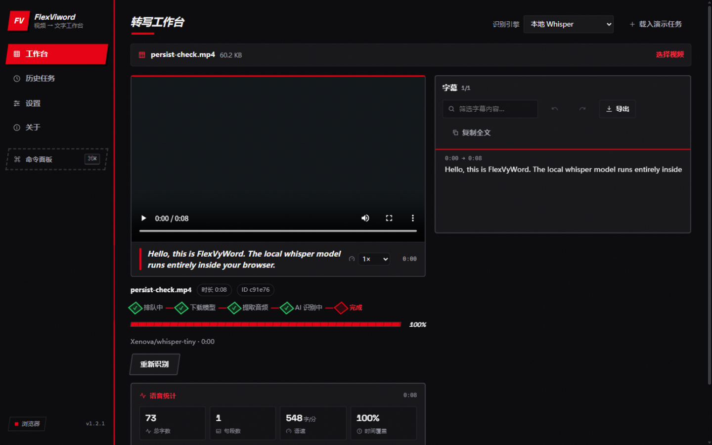
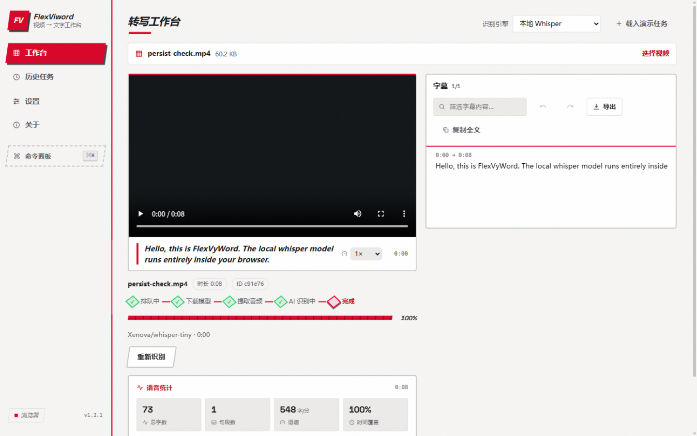
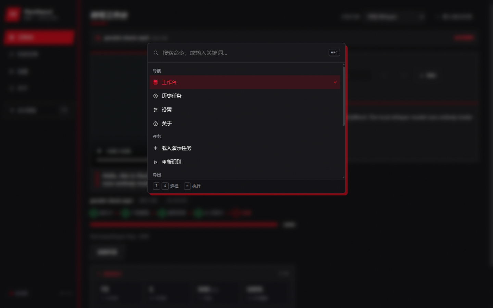
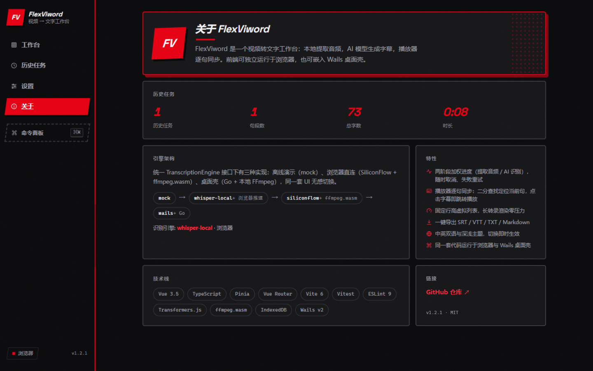
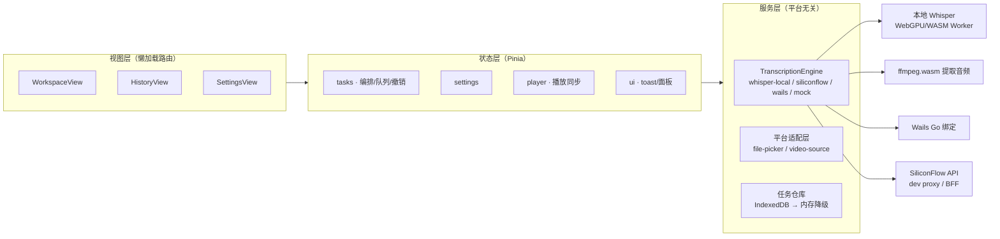

# FlexViword 🎥 ➡️ 📝

**视频/音频 → 文字工作台**：拖入媒体文件，本地提取音频，AI 生成字幕，播放器逐句同步。前端完全独立运行于浏览器（含本地 Whisper 模型，无需任何 API Key），也可嵌入 Wails 桌面壳。


| 工作台（深色 · Punk Red） | 工作台（浅色） |
| --- | --- |
|  |  |

| ⌘K 命令面板 | 关于页（Bento + 半调网点） |
| --- | --- |
|  |  |

## ✨ 功能特性

### 四种输入源
- **视频/音频文件**：拖拽或点击选择，支持 mp4 / mov / mkv / mp3 / wav / m4a / aac / ogg / opus / flac
- **批量导入**：多选与多文件拖拽，单并发队列自动排队，toast 反馈导入数量
- **麦克风录音 → 转写**：录完即转（MediaRecorder，浏览器与桌面端均可用）
- **链接导入（桌面端）**：粘贴 YouTube / B站等链接，本机 yt-dlp 下载后自动转写
- **文件夹导入（桌面端）**：一键枚举文件夹内全部媒体文件批量建任务

### 四种可插拔转写引擎
统一 `TranscriptionEngine` 接口，同一套 UI 无感切换：

| 引擎 | 说明 | 平台 |
| --- | --- | --- |
| `whisper-local` | **本地 Whisper**（Transformers.js + ONNX）：WebGPU 自动加速、权重浏览器缓存、真实时间戳、HF 镜像回退，**无需 API Key、数据不出设备** | 双端 |
| `siliconflow` | SiliconFlow 云端识别（浏览器经开发代理 / BFF） | web |
| `wails` | 桌面壳内经 Go 直连云端（无 CORS），模型参数由设置透传 | 桌面 |
| `mock` | 离线演示引擎，零配置体验完整流水线 | 双端 |

### 工作台能力
- **播放器逐句同步**：二分查找命中当前句、点击字幕跳转、跟随滚动、当前句大字幕条、0.5–2× 倍速
- **任务标签页**：工作台内直接切换/关闭任务，与 `?task=` URL 双向同步（刷新可恢复、链接可分享）
- **编辑 · 撤销/重做 · 统计**：逐句编辑（防抖落库 + 整表快照撤销栈）、语音统计（字数/句段/语速/覆盖率 + 手写 SVG 密度分布图）
- **导出**：SRT / VTT / TXT / Markdown，先预览再下载；一键复制全文
- **本地持久化**：任务与媒体文件存 IndexedDB，刷新不丢；隐私模式自动降级为会话内存
- **⌘K 命令面板**：自实现子序列模糊搜索（命中高亮），导航/任务/导出/外观全键盘操作
- **国际化 + Punk Red 主题**：中英双语、深浅主题即时切换；红黑白三色、平行四边形 chrome、半调网点、硬投影、斜切粗黑标题（Space Grotesk 自托管）

### 工程化
TypeScript strict · ESLint 9 (flat) + Prettier · Vitest 109 例 + Go test · GitHub Actions CI · 路由级代码分割 · `prefers-reduced-motion` 与 WCAG AA（焦点陷阱/骨架屏/对比度）

## 🏛️ 架构一览



详细设计（数据流、进度模型、取消链路、持久化策略、跨端兼容性矩阵、踩坑实录）见 [docs/ARCHITECTURE.md](docs/ARCHITECTURE.md)；面试视角的亮点讲解见 [docs/INTERVIEW.md](docs/INTERVIEW.md)。

## 🚀 快速开始

### 方式一：纯前端（浏览器）—— 无需 Go / FFmpeg / API Key

```bash
cd frontend
npm install
npm run dev        # http://localhost:5173
```

打开后点击 **「+ 载入演示任务」** 零配置体验完整流水线；或直接拖入视频/音频文件，引擎选择 **本地 Whisper**（首次使用下载模型权重，之后走浏览器缓存）。

接入云端识别：`设置 → API 配置` 填入 [SiliconFlow](https://cloud.siliconflow.cn/) API Key（浏览器经开发代理 `/api/siliconflow` 转发，规避 CORS）。

### 方式二：桌面应用（Wails）

前置：Go 1.21+、[Wails CLI](https://wails.io)、Node 18+、本地 FFmpeg；链接导入额外需要 [yt-dlp](https://github.com/yt-dlp/yt-dlp)。

```bash
go mod tidy
wails dev      # 开发
wails build    # 产物在 build/bin/
```

桌面模式额外能力：系统文件对话框、本地 FFmpeg 提取音频、本地视频流播放（支持 Range 拖动进度条）、链接下载与文件夹批量导入。

### 常用命令（frontend/）

| 命令 | 说明 |
| --- | --- |
| `npm run dev` | 开发服务器 |
| `npm run build` | 类型检查 + 生产构建 |
| `npm test` | Vitest 单元测试（109 例） |
| `npm run lint:check` / `npm run lint` | ESLint 检查 / 自动修复 |
| `npm run type-check` | vue-tsc 严格类型检查 |

Go 侧：`go build ./...` / `go test ./...`

## 📁 目录结构

```
frontend/src/
├── types/          # 领域模型（Task/Segment/Engine/MediaKind）
├── utils/          # 纯函数：时间码/断句/导出/模糊搜索/统计/WAV 编解码
├── services/
│   ├── bridge/     # 平台适配：web ↔ wails 宿主差异收敛于此
│   ├── engines/    # TranscriptionEngine 四实现 + 注册表/解析器
│   ├── audio/      # ffmpeg.wasm 提取（CDN 回退 + 超时）
│   └── db/         # IndexedDB 封装 + 任务仓库（可降级）
├── stores/         # Pinia：tasks 编排 / settings / player / ui
├── composables/    # 虚拟列表/二分同步/焦点陷阱/命令/录音/URL 同步
├── components/     # common / layout / workspace（含任务标签页）
├── views/          # 路由级视图（懒加载）
├── workers/        # Whisper 推理 Worker（WebGPU/WASM）
└── i18n/           # 手写微型 i18n（zh-CN / en-US 同构类型约束）

download/ media/ transcription/   # Go：yt-dlp 下载 / 流媒体服务+FFmpeg / 云端识别
```

## 🔒 隐私与安全

- 媒体文件只在本地处理：浏览器端音频提取由 ffmpeg.wasm 完成，本地模型推理在页面内 Worker 进行
- API Key 仅保存在本机浏览器，不上传任何服务器；生产部署建议经自建轻量 BFF 转发
- 桌面端本地流服务以 `127.0.0.1` 随机端口 + 随机令牌鉴权（防本机跨进程读取与 DNS rebinding），支持 Range 拖动

## 📄 License

MIT
