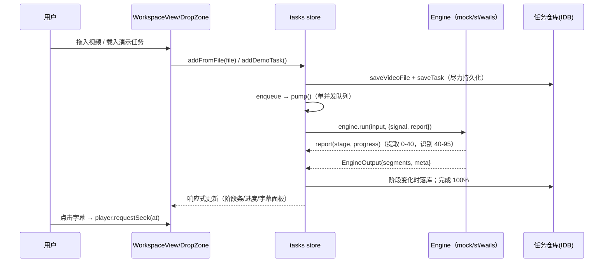

# 架构设计

本文记录 FlexViword 前端的分层结构、关键数据流与每一个"值得在面试里讲清楚"的取舍。

## 1. 分层

```
views（路由级，懒加载）
  └── components（展示组件，只读 store + 发动作）
        └── stores（Pinia：tasks 编排 / settings / player / ui）
              └── services（平台无关业务）
                    ├── engines/   TranscriptionEngine 接口 + mock/siliconflow/wails 三实现
                    ├── bridge/    平台适配（web ↔ wails 宿主差异）
                    ├── audio/     ffmpeg.wasm 提取器
                    └── db/        IndexedDB 任务仓库（可降级内存）
                          └── utils（纯函数：时间码/断句/导出/取消）
```

原则：**组件不碰引擎与 IndexedDB，store 不碰 DOM，services 不依赖 Vue 组件层**（仅依赖响应式 API 与类型）。这让 services 与 stores 可以在 Node 里直接测试。

## 2. 核心数据流：一次转写任务



要点：

- **单并发队列**：`queue: string[]` + `runningId`，`pump()` 完成后自举取下一个。转写是重 IO/CPU 任务，并发只会互相抢带宽；排队 + 可取消是更诚实的模型。
- **进度加权**：提取音频 0–40%，上传识别 40–95%，收尾 100%。两阶段速率差异大，线性进度会长时间"卡住"误导用户。
- **取消传播**：store 持有 `AbortController`；`sleep(ms, signal)` / `fetch(..., {signal})` / `ffmpeg.terminate()` 全链路响应同一个 signal，取消后任务标 `canceled` 而非 `failed`（`DOMException(AbortError)` 单独识别）。

## 3. 引擎抽象（依赖倒置）

```ts
interface TranscriptionEngine {
  id: EngineId
  isReady(settings): boolean
  run(input: EngineInput, ctx: EngineContext): Promise<EngineOutput>
}
```

| 实现 | 提取音频 | 识别 | 适用宿主 |
| --- | --- | --- | --- |
| `mock` | 模拟（sleep） | 生成演示字幕 | 任意（零配置演示） |
| `whisper-local` | ffmpeg.wasm（浏览器本地） | **本地 Whisper**（Transformers.js + ONNX Runtime WASM，Web Worker 内推理） | 任意（无需 API Key） |
| `siliconflow` | ffmpeg.wasm（浏览器本地） | fetch → SiliconFlow（dev proxy/BFF） | web |
| `wails` | Go 侧本地 FFmpeg | Go 侧转发（SiliconFlow，模型参数由前端设置透传） | wails 桌面壳 |

> 兼容性约定：桌面壳里 siliconflow 引擎不可用（无 File 对象），同一云服务由 `wails` 引擎经
> Go 直连覆盖——因此 siliconflow 被标记 web-only，桌面下拉禁用（"· Web" 后缀）。取消语义按
> 引擎能力分级：web 路径即时中断（fetch/ffmpeg terminate/worker terminate）；桌面 Go 绑定
> 不可中断，用 `Promise.race` 让取消立即生效（后台调用自然结束、结果丢弃）。

`resolveEngine(platform, settings)` 负责策略：显式选择 > auto（按平台偏好）> 降级 mock 并给出原因（UI 用 toast 提示降级）。**auto 永远不会自动选中 whisper-local** —— 首次使用要下载 40–250MB 权重，这个成本必须由用户显式决定。**Wails 绑定不做静态 import**，运行时从 `window.go` 读取，纯浏览器构建不携带桌面代码。

### 本地 Whisper 引擎（whisper-local）

流水线与进度映射：加载模型（downloading 0–35，命中浏览器缓存时瞬间完成）→ 提取音频（extracting 35–70）→ Worker 内推理（transcribing 70–95）。

- **推理在 Web Worker**：`@huggingface/transformers` 动态 import 进 worker chunk（构建产物 ~874KB 独立 chunk，主包零占用）；权重经 HF CDN 下载后由浏览器缓存复用，主源不可达自动切 hf-mirror.com 重试
- **真实时间戳**：`return_timestamps: true` 返回逐块时间轴（`meta.timingEstimated = false`），比"无时间戳估算"质量高一个档位
- **文件检查前置**：先校验视频存在再加载模型，演示任务不会白下 40MB 权重
- **取消 = terminate**：wasm 推理无法中断，AbortSignal 触发即杀掉 Worker，下次重建（权重仍在 HTTP 缓存，重载很快）
- **直读 16kHz PCM**：提取端固定输出 pcm_s16le/16k/单声道，绕过 `AudioContext.decodeAudioData` 的硬件重采样，手写 WAV 解析（`utils/wav.ts`，含往返测试）

### 本地化的三个真实坑（E2E 调试实录）

1. **Vite dev 下 ffmpeg 类 Worker 404**：`@ffmpeg/ffmpeg` 默认 `new Worker(new URL('./worker.js', import.meta.url))`，依赖被预打包后该路径不存在 → `load()` 永久挂起。解法：`import workerUrl from '@ffmpeg/ffmpeg/worker?worker&url'` + `load({ classWorkerURL })`，并把 `worker.format: 'es'` 写进 vite 配置。
2. **content-length 对账失配**：`@ffmpeg/util` 的 `toBlobURL` 流式下载时用 content-length（压缩后大小）核对解压后字节数，gzip/br 传输下必然抛"下载不完整"，其回退又对已消费的流二次 `arrayBuffer()` 抛错。解法：自实现流式下载器，只信实际字节数。
3. **UMD 核心在 module worker 里 import 不到**：`importScripts` 在 module worker 不存在，回退 `import(umd核)` 又没有 default 导出。解法：CDN 上有 `/dist/esm/` 变体核心（带 default 导出），直接用它。

另外 `@huggingface/transformers` 必须加入 `optimizeDeps.include`：否则 dev 首次使用时触发 re-optimize + 整页 reload，会打断正在运行的任务。

### 无时间戳文本 → 可同步字幕

SenseVoice 只返回整段文本。`estimateSegments` 先按中英标点断句（lookbehind 正则 + 碎句合并），再按每句字数占比把总时长加权分配，得到近似时间轴（`meta.timingEstimated = true` 诚实标记）。这让"纯文本结果"也能获得播放器逐句同步体验。

## 4. 播放器-字幕同步

- `<video>` 是唯一的时钟源：`timeupdate`（约 4Hz）驱动 `currentTime`
- `findSegmentIndexAt(segments, t)`：有序区间二分查找，O(log n) 定位当前句；句间空隙保留上一句高亮（字幕软件惯例）
- 反向跳转用 `seekRequest = { at, token }` 而非裸时间：**token 自增让"同一时刻的重复跳转"也能触发 watch**
- 字幕面板是固定行高虚拟列表（`useVirtualList`）：可见窗口 + overscan，滚动时 O(1) 计算起点。可变行高的扩展路径是"前缀和 + 二分"，接口不变

## 5. 持久化模型

- IndexedDB 两个 store：`tasks`（元数据 + 字幕，keyPath id）、`files`（原始视频 File，显式 key）
- **写放大控制**：进行中的百分比进度只留在内存，阶段变化才落库；字幕编辑 600ms 防抖合并写入
- 大文件超出配额：捕获异常，保留内存引用，任务元数据仍可持久化
- **隐私模式降级**：仓库层统一 try/catch，IDB 不可用时退化为 Map，功能不中断，UI 提示"仅本次会话"

## 6. 平台适配层

| 差异点 | web | wails |
| --- | --- | --- |
| 选文件 | `<input type=file>`（监听 change/cancel） | Go `SelectVideo` 对话框 |
| 视频播放 | File → ObjectURL（切换时 revoke） | Go 起本地流服务（`http.ServeContent` 支持 Range；`?t=` 随机令牌鉴权，防本机跨进程/DNS rebinding 读取） |
| 音频提取 | ffmpeg.wasm（单线程核心，免 COEP 头） | 本地 FFmpeg 子进程 |
| 网络识别 | fetch（dev proxy / BFF 解决 CORS） | Go 进程内转发（无 CORS） |

检测方式：`'go' in window && 'runtime' in window`。宿主差异全部收敛在 `services/bridge`，上层永远面向抽象。

## 7. 工程化决策

| 决策 | 理由 |
| --- | --- |
| 手写 ~40 行 i18n | 只需 dot-path 查找 + 插值 + 回退；`enUS: typeof zhCN` 让漏译在编译期报错。要长大时再平滑换 vue-i18n |
| Hash Router | 桌面壳（wails://）与静态部署（无服务端重写）都能工作 |
| ffmpeg.wasm 单线程核心 | 多线程核心需要 SharedArrayBuffer → COOP/COEP 响应头，部署成本高；单线程免头可用。核心 wasm (~30MB) 懒加载，首次提取才拉取 |
| 进度不落库、阶段才落库 | IndexedDB 写放大控制（见 §5） |
| 引擎错误统一 `EngineError{code}` | UI 按 code 做 i18n 映射，不把原始异常暴露给用户 |
| Vitest + fake-indexeddb | store/服务在 Node 直接测试。坑：fake timers 会劫持 `queueMicrotask` 导致 IDB 死锁，需 `toFake: ['setTimeout','clearTimeout']` 精确指定 |

## 8. v1.1 增补：命令面板 · 撤销重做 · 语音统计

### ⌘K 命令面板

- **模糊检索是纯函数**（`utils/fuzzy.ts`）：子序列匹配 + 打分（连续命中 +16、词首/驼峰边界 +14、普通 +6、间隙与跨度惩罚），返回命中下标供 `<mark>` 高亮；label 命中优先于 keywords 命中（后者 -4 分）。无依赖、可单测、可平移进 Worker。
- **命令注册表是响应式 computed**（`useCommands`）：语言切换、任务状态变化时命令列表自动重建（如"取消任务"只在运行中出现，"重新识别"只在终态出现）。
- **快捷键系统**（`useHotkeys`）支持 `mod+k` / `mod+shift+z` 组合语法与 `allowInInput` 豁免；未声明的修饰键按下时不匹配，避免 mod+k 误吞 mod+shift+k。

### 字幕编辑撤销/重做

命令栈模式：每次编辑前把**整表快照**（浅拷贝的 segments 数组）压入该任务的 undo 栈（上限 50），撤销/重做交换栈顶快照。选择"整表快照"而非"增量 inverse patch"：实现 20 行、无边界情况，字幕量级（数千条 × 浅拷贝）内存完全可控。历史栈用 `reactive(new Map())` 驱动按钮的 disabled 态；任务删除时同步清理。注意撤销会**整体替换** segments 数组——组件层持有旧元素引用会过期（测试里专门覆盖了这一点）。

### 语音统计面板

`utils/stats.ts` 纯函数计算：字数（去空白）、语速（字/分）、时间覆盖率（只计有内容的句段）、24 桶字符密度直方图（长句字符均匀摊到覆盖的桶）。分布图是手写 SVG `<rect>`，无图表库依赖，柱高入场动画只动 `transform: scaleY`。

### 视觉系统：「Punk Red」（女神异闻录语言）

依据 taste-skill（反 AI 俗套）与 anthropics/frontend-design（"把大胆花在一个地方"）双重准则，v1.3 将视觉语言整体置换为**红黑白三色的 P5 母题**——不是只换个红色 accent，而是完整的形状语言：

- **平行四边形 = 可交互**：按钮/导航项/徽章 `skewX(-8deg)`，内容反斜切保持直立；激活态红底白字 + 硬投影
- **斜切粗黑标题 = 层级**：display 字体 oblique + 800 字重 + 红色斜杠下划线（`.content h2::after`）
- **半调网点 = 装饰区**：DropZone 背景、About hero 右缘（radial-gradient 点阵，颜色跟随主色）
- **星形爆点 = 空态符号**：clip-path 12 角星 + 弹入动画
- **硬投影 = 主要动作**：`6px 6px 0` 位移阴影（贴纸感），替代多层柔影
- **分段能量条 = 进度**：repeating-linear-gradient 硬分隔的红色段
- 纪律：punk 只花在 chrome 层，字幕文本/统计数字等内容区保持安静；正文对比度 ≥4.5:1、reduced-motion、键盘焦点三条底线不放弃

## 9. v1.2.1 增补：可访问性与状态纪律（对照 addyosmani/frontend-ui-engineering）

### 焦点管理（WCAG 2.1 AA）

- `useFocusTrap`：对话框/命令面板打开时移焦进入、Tab 循环锁定在面板内、关闭时焦点还原到触发元素。核心 `trapTab(focusable, current, shift)` 是纯函数（首尾环绕、外部拉入、shift 反向），单测直接覆盖；DOM 接线（capture 阶段 keydown + `checkVisibility` 过滤）只有十几行
- Esc 关闭挂在 window 上（面板打开期间），焦点在结果列表里也能关——只绑在输入框上是个真实可达性 bug，测试时 Tab 三下就暴露了

### 状态管理阶梯的落位

按 skill 的"最简单可用"阶梯自查：组件本地状态用 `ref`（筛选词、编辑草稿）；跨 2-3 组件的播放位置/跳转用 Pinia `player`（比 prop drilling 干净）；主题/语言/任务这类读多写少的全局态归 Pinia；**可分享/可恢复的 UI 状态上 URL** —— 当前任务写入 `?task=` 查询参数（`useCurrentTaskRouteSync`），刷新可恢复、链接可分享，非法值容错。没有任何 prop 钻透超过 3 层。

### 三态与骨架屏

- 识别中的字幕区显示**骨架屏**（脉冲动画只动 opacity，`aria-busy` + `role="status"`），而不是空白或转圈
- 所有空态带图标/标题/描述/CTA，标记 `role="status"`
- 加载/错误/空三态在全视图覆盖：任务失败显示原因 + 重试按钮，IDB 不可用显示"仅本次会话"提示

### 持久化的隐性数据丢失（本次排雷最大收获）

`indexedDB.put` 对对象做结构化克隆，而 **Proxy 无法被克隆**。store 传给仓库的记录是响应式代理（嵌套的 `segments`/`video` 也是），浅拷贝 `{...task}` 救不了内层 —— 于是"创建之后的任何更新"（阶段流转、识别结果、字幕编辑）全部在仓库的 catch 里被静默吞掉，IDB 永远停在初次创建的 queued 状态，且 UI 毫无感知。修复：入库前 `JSON.parse(JSON.stringify())` 深转纯对象 + 降级时 `console.warn` 留痕 + **直读 IndexedDB 的回归测试**（绕过仓库的内存兜底，让这类 bug 无法再藏）。方法论沉淀：凡是"静默降级"的 catch，必须有可观测出口（日志/状态标志），否则等于给数据丢失上了保险。

### 同类竞态

- `init()` 尾部无条件 `currentId = tasks[0]` 会踩掉装载期间用户的选择 → 改为 `??=` 仅在未选择时兜底
- `initialized` 标志在装载完成前置位，依赖它判断"已就绪"的代码会读到空数组 → `init()` 改为共享 Promise，并发调用等待同一次装载

## 10. 已知权衡与改进方向

- API Key 存 localStorage 有 XSS 风险 → 桌面端可换 OS keychain；web 端可改会话内存 + BFF 下发短期 token
- 估算时间轴在语速不均匀时偏差较大 → 可接 whisper 类带词级时间戳的引擎，接口已就绪
- ffmpeg.wasm 单线程提取长视频较慢 → Web Worker + 进度上报已具备（`@ffmpeg/ffmpeg` 本身 worker 化），可换多线程核心 + COEP
- 测试目前覆盖 stores/services/utils，组件级测试与 Playwright E2E 是下一步
